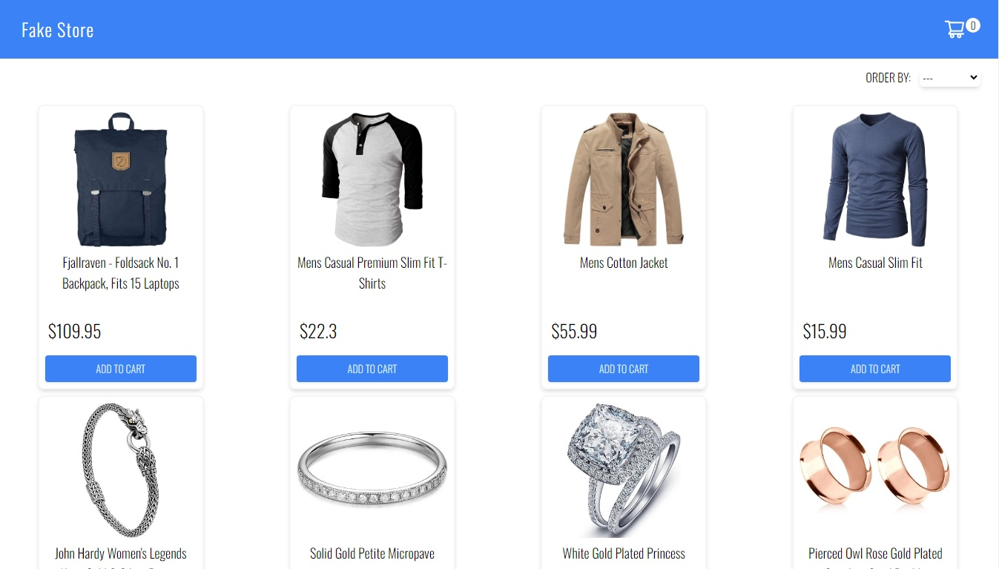
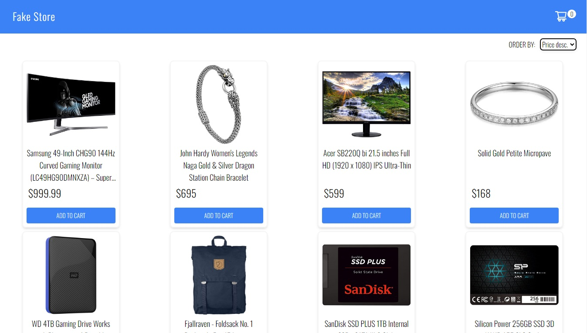
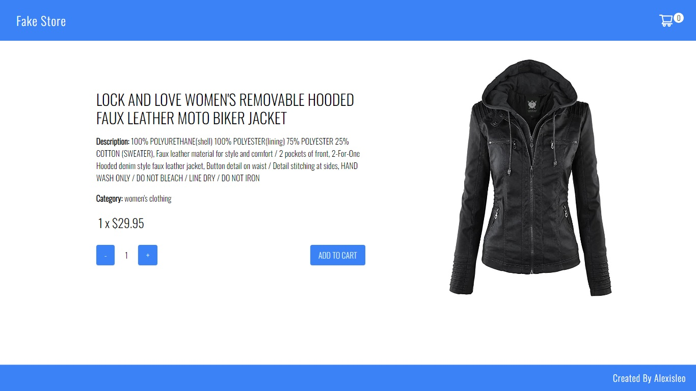
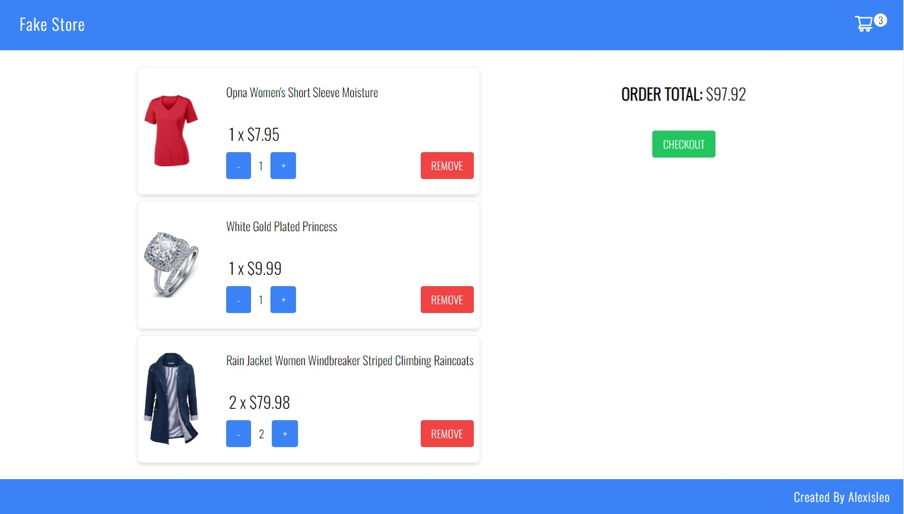
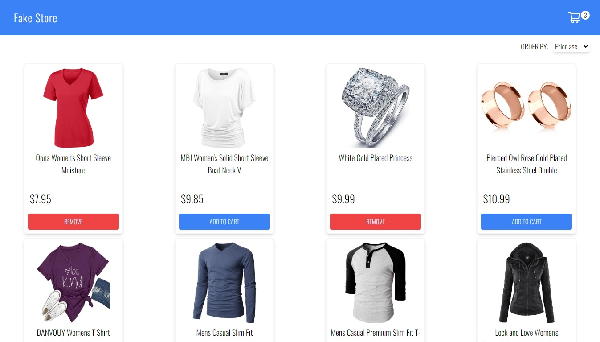
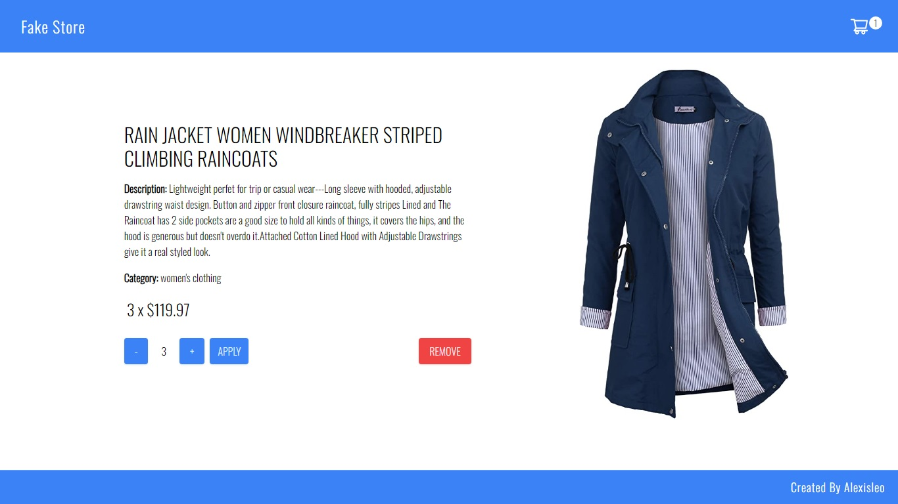
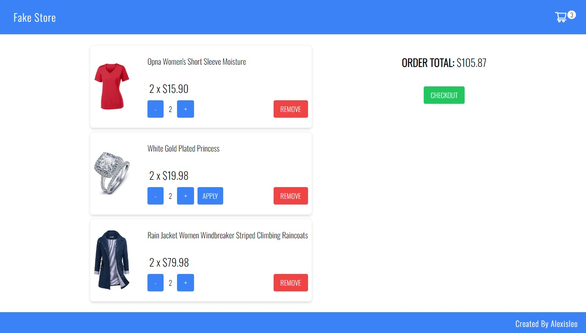

# Simple E-Commerce App

Esta es una aplicación web (SPA) de comercio electrónico simple y responsive construida con React y Node.

La idea general consistió en crear una aplicación en la cual se puedan ver diferentes productos de una tienda, junto con información relevante de los mismos, utilizando la API externa [fakestoreapi](https://fakestoreapi.com/).

## Frontend

En el desarrollo frontend de la aplicación, se emplearon React con Hooks, Tailwind y SessionStorage.

## Capturas de Pantalla

A continuación, te presento algunas capturas de pantalla que te dan una idea visual de las características más destacadas de la aplicación:

**Inicio:**


**Filtros:**


**Detalles:**


**Carrito:**


**Botón de agregar al carrito:**


**Modificar la cantidad al agregar desde Detalles:**


**Modificar la cantidad al agregar desde Carrito:**



### Iniciar la Aplicación desde el Lado del Frontend:

Si deseas ejecutar la aplicación en tu entorno local, sigue estos sencillos pasos:

1. Navega hasta la carpeta principal del cliente:
   ```bash
   cd client
   ```

2. Instala las dependencias de la aplicación utilizando npm:
   ```bash
   npm install
   ```

3. Inicia la aplicación en modo de desarrollo:
   ```bash
   npm start
   ```

4. Abre tu navegador web y visita http://localhost:3000 para explorar la aplicación.

## Backend

La sección de backend de la aplicación está basada en tecnologías como Node y Express, y se implementan las siguientes rutas esenciales:

- [x] __GET /productos__:
  - Retorna un listado de productos disponibles.

### Iniciar la Aplicación desde el Lado del Backend:

Si tienes curiosidad y quieres probar la aplicación en tu propio entorno, sigue estos pasos:

1. Dirígete a la carpeta principal del servidor:
  ```bash
  cd server
  ```

2. Instala las dependencias de la aplicación utilizando npm:
  ```bash
  npm install
  ```

3. Inicia la aplicación en modo de desarrollo:
  ```bash
  npm start
  ```

4. Abre tu navegador web y visita http://localhost:3001 para explorar la aplicación.
